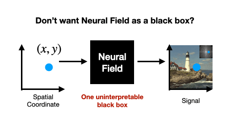

# Polynomial Neural Fields for Subband Decomposition and Manipulation

Pytorch implementation for the **NeurIPS 2022** paper:

[Polynomial Neural Fields for Subband Decomposition and Manipulation](https://openreview.net/pdf?id=juE5ErmZB61)

[Guandao Yang*](https://www.guandaoyang.com/), 
[Sagie Benaim*](https://sagiebenaim.github.io/), 
[Varun Jampani](https://varunjampani.github.io/),
[Kyle Genova](https://www.kylegenova.com/),
[Jonathan T. Barron](https://jonbarron.info/),
[Thomas Funkhouser](https://www.cs.princeton.edu/~funk/),
[Bharath Hariharan](http://home.bharathh.info/),
[Serge Belongie](https://blogs.cornell.edu/techfaculty/serge-belongie/),




## Introduction

Neural fields have emerged as a new paradigm for representing signals, thanks to
their ability to do it compactly while being easy to optimize. In most applications,
however, neural fields are treated like a black box, which precludes many signal
manipulation tasks. In this paper, we propose a new class of neural fields called
basis-encoded polynomial neural fields (PNFs). The key advantage of a PNF is
that it can represent a signal as a composition of a number of manipulable and
interpretable components without losing the merits of neural fields representation.
We develop a general theoretical framework to analyze and design PNFs. We use
this framework to design Fourier PNFs, which match state-of-the-art performance
in signal representation tasks that use neural fields. In addition, we empirically
demonstrate that Fourier PNFs enable signal manipulation applications such as
texture transfer and scale-space interpolation. 


## Code will be avaiblae soon! 

## Citation 

If you find our paper or code useful, please cite us:
```
@inproceedings{yang2022pnf,
  title={Polynomial Neural Fields for Subband Decomposition and Manipulation},
  author={Yang, Guandao and Benaim, Sagie and Jampani, Varun and Genova, Kyle and Barron, Jonathan and Funkhouser, Thomas and Hariharan, Bharath and Belongie, Serge},
  booktitle={Thirty-Sixth Conference on Neural Information Processing Systems},
  year={2022}
}
```

## Acknowledgement
This research was supported by the Pioneer Centre for AI, DNRF grant number P1.
Guandao’s PhD was supported in part by research gifts from Google, Intel, and Magic Leap.
Experiments are supported in part by Google clouds platform and GPUs donated by NVIDIA.